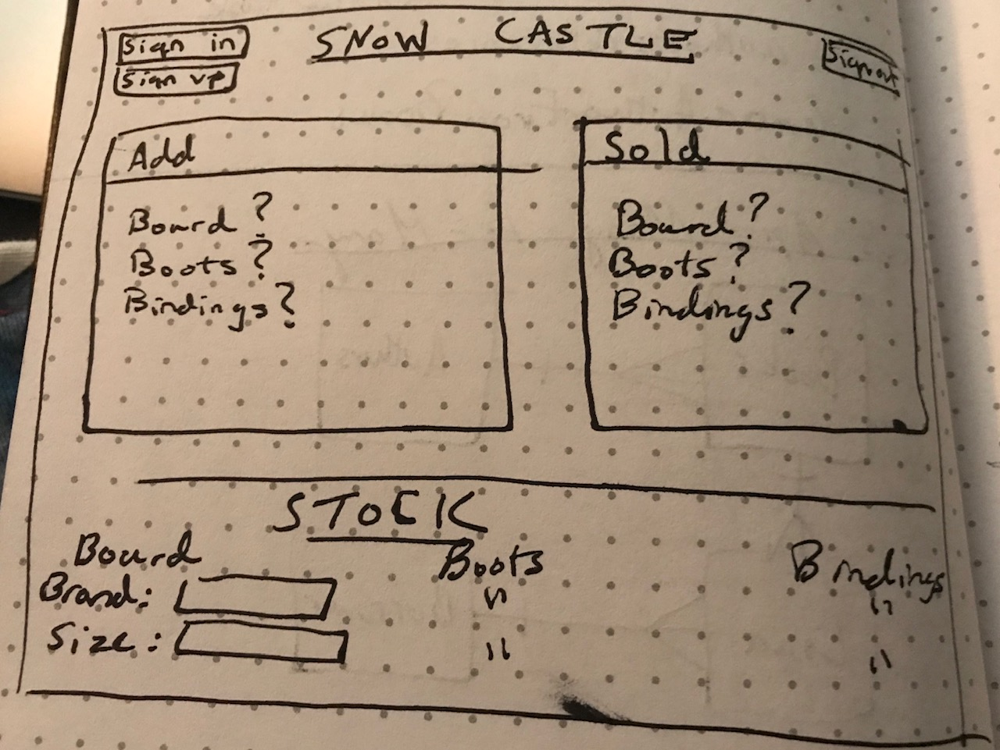

Here is the back end code for this application. It can be located at:
https://github.com/Thavriliak/snow-castle-client-back-end-client
https://morning-gorge-80977.herokuapp.com

Snow castle is a single page web application for local ski/snowboard shops to store their inventory. It allows the user to properly sign up, log in, change passwords, and sign out when necessary. Also, the user can create both brands and products that they would like to hold within their stores. As for inventories, you can create, patch, delete, get one or get all products depending on what they would like to do. Also they can add and delete any brands that they would like to carry in their store, and they can view all brands that they carry so they can link them to their inventories. When it comes to my wireframe, here is a distinctive picture of what I planned for the website to look like:

As for going on with this project, I hope to expand it so that when a user gets all inventories or brands, only the ones associated to their user ids is shown as this obviously can be quite a bit confusing for the client. I would also like to eventually enable search capabilities, so that the user can search for one specific category and get results back based on the search. I would also like for the site to look visually better, maybe adding on pictures and a better layout than what I have currently.

User Stories:

- User can sign up, sign in, sign out, and change password in authentication.
- User can see if any requests to the server succeeded or failed.
- User has no client facing errors.
- User can add, edit, delete, and get inventories and brands.
